# Overview 组件总览

FunPlus 提供的相对丰富，功能简单且够用的组件。

## basic 基础组件
<Row :gutter="20">
  <Col :span="3">
    <router-link to="/components/layout">
      <Card title="Layout">
        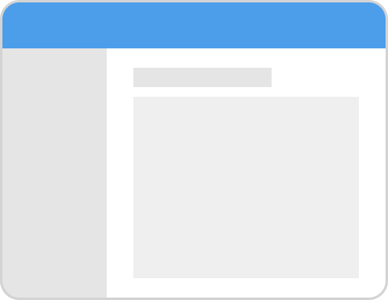
      </Card>
    </router-link>
  </Col>
  <Col :span="3">
    <router-link to="/components/grid">
      <Card title="Grid">
        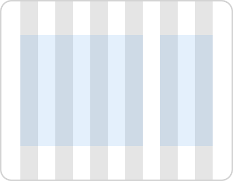
      </Card>
    </router-link>
  </Col>
  <Col :span="3">
    <router-link to="/components/icon">
      <Card title="Icon">
        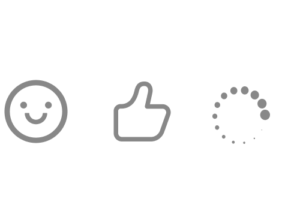
      </Card>
    </router-link>
  </Col>
  <Col :span="3">
    <router-link to="/components/button">
      <Card title="Button">
        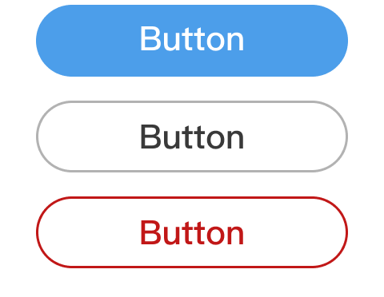
      </Card>
    </router-link>
  </Col>
</Row>

## navigation 导航
<Row :gutter="20">
  <Col :span="3">
    <router-link to="/components/breadcrumb">
      <Card title="Breadcrumb">
        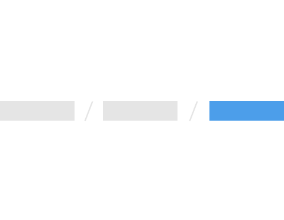
      </Card>
    </router-link>
  </Col>
  <Col :span="3">
    <router-link to="/components/stepper">
      <Card title="Stepper">
        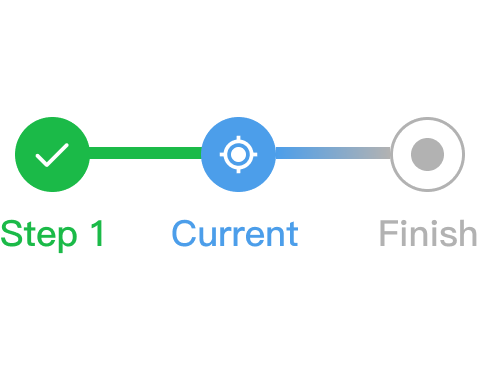
      </Card>
    </router-link>
  </Col>
  <Col :span="3">
    <router-link to="/components/backtop">
      <Card title="BackTop">
        
      </Card>
    </router-link>
  </Col>
  <Col :span="3"></Col>
</Row>

## form 表单
<Row :gutter="20">
  <Col :span="3">
    <router-link to="/components/form">
      <Card title="Form">
        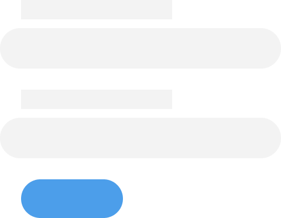
      </Card>
    </router-link>
  </Col>
  <Col :span="3">
    <router-link to="/components/input">
      <Card title="Input">
        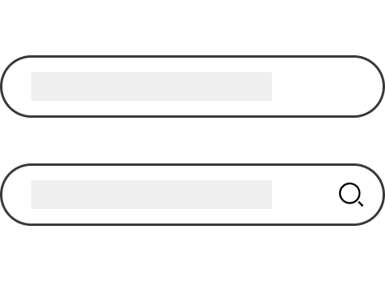
      </Card>
    </router-link>
  </Col>
  <Col :span="3">
    <router-link to="/components/textarea">
      <Card title="TextArea">
        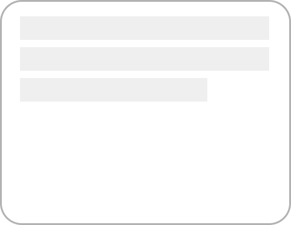
      </Card>
    </router-link>
  </Col>
  <Col :span="3">
    <router-link to="/components/numberinput">
      <Card title="NumberInput">
        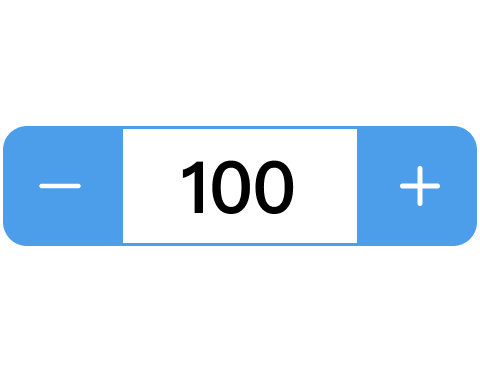
      </Card>
    </router-link>
  </Col>
</Row>
<Row :gutter="20">
  <Col :span="3">
    <router-link to="/components/radio">
      <Card title="Radio">
        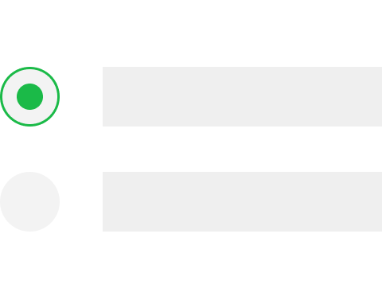
      </Card>
    </router-link>
  </Col>
  <Col :span="3">
    <router-link to="/components/checkbox">
      <Card title="CheckBox">
        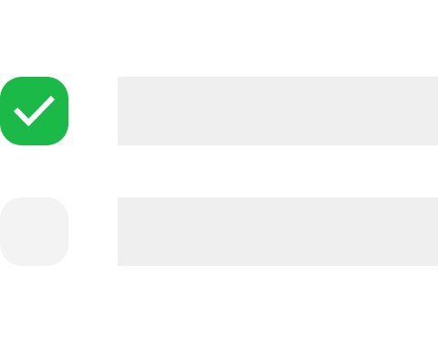
      </Card>
    </router-link>
  </Col>
  <Col :span="3">
    <router-link to="/components/select">
      <Card title="Select">
        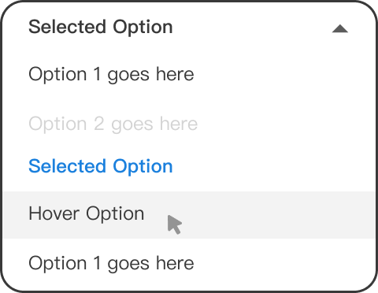
      </Card>
    </router-link>
  </Col>
  <Col :span="3">
    <router-link to="/components/switch">
      <Card title="Switch">
        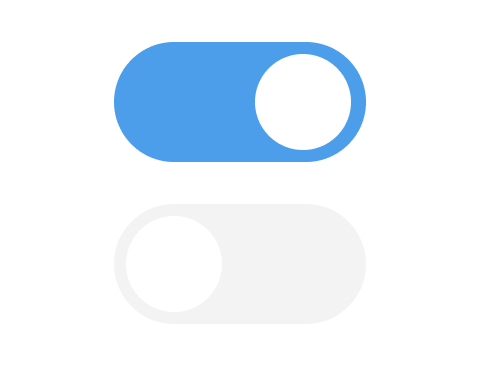
      </Card>
    </router-link>
  </Col>
</Row>

## data presentation 数据展示
<Row :gutter="20">
  <Col :span="3">
    <router-link to="/components/tooltip">
      <Card title="ToolTip">
        
      </Card>
    </router-link>
  </Col>
  <Col :span="3">
    <router-link to="/components/popover">
      <Card title="Popover">
        
      </Card>
    </router-link>
  </Col>
  <Col :span="3">
    <router-link to="/components/skeleton">
      <Card title="Skeleton">
        
      </Card>
    </router-link>
  </Col>
  <Col :span="3">
    <router-link to="/components/pagination">
      <Card title="Pagination">
        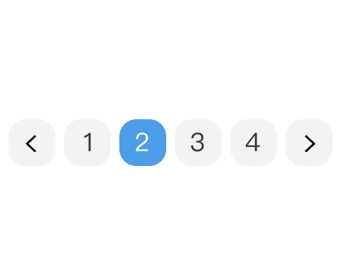
      </Card>
    </router-link>
  </Col>
</Row>

## feedback 反馈
<Row :gutter="20">
  <Col :span="3">
    <router-link to="/components/alert">
      <Card title="Alert">
        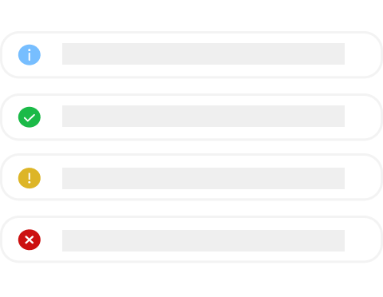
      </Card>
    </router-link>
  </Col>
  <Col :span="3">
    <router-link to="/components/notification">
      <Card title="Notification">
        
      </Card>
    </router-link>
  </Col>
  <Col :span="3">
    <router-link to="/components/message">
      <Card title="Messsage">
        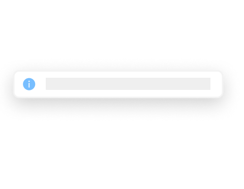
      </Card>
    </router-link>
  </Col>
  <Col :span="3">
    <router-link to="/components/toast">
      <Card title="Toast">
        
      </Card>
    </router-link>
  </Col>
</Row>
<Row :gutter="20">
  <Col :span="3">
    <router-link to="/components/dialog">
      <Card title="Dialog">
        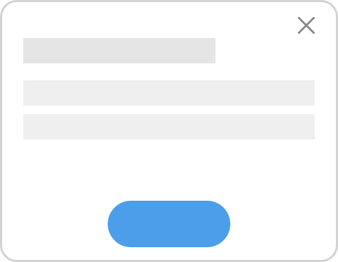
      </Card>
    </router-link>
  </Col>
  <Col :span="3">
    <router-link to="/components/drawer">
      <Card title="Drawer">
        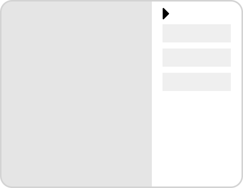
      </Card>
    </router-link>
  </Col>
  <Col :span="3"></Col>
  <Col :span="3"></Col>
</Row>

## media 媒体
<Row :gutter="20">
  <Col :span="3">
    <router-link to="/components/video">
      <Card title="Video">
        
      </Card>
    </router-link>
  </Col>
  <Col :span="3">
    <router-link to="/components/audio">
      <Card title="Audio">
        
      </Card>
    </router-link>
  </Col>
  <Col :span="3"></Col>
  <Col :span="3"></Col>
</Row>